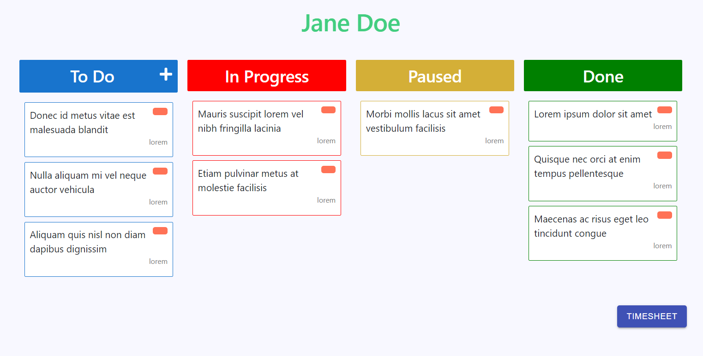
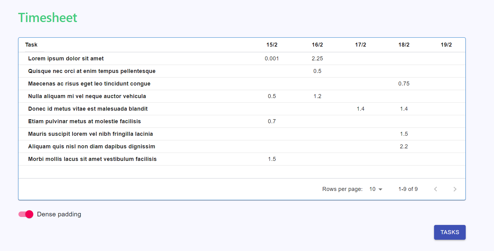
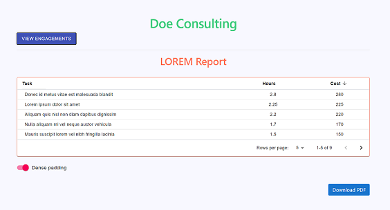

# Trase

## Description 

`Client 1`: Roger  
Roger wants company X to develop a website for his new company.

Roger has the opportunity to <u>profit</u> from this investment. He can improve business credibility, enhance online presence and expand market reach/coverage among many other profitability opportunities.

Roger primarily wants deadlines to be met and the work to be of top quality. 

`Client 2`: Rafael  
Rafael needs company Y to deal with a legal case that he is stuck in. He has no other choice but to seek professional aid. 

Rafael <i>does not</i> have any opportunity to profit from this investement. 

Along with high quality work, <b>Rafael wants to see the time and cost of each task that is done in his case.</b>

`Value Propositon`  
By leveraging the Kanban ideology, Trase <b><i>automatically</i></b> manages the time and cost of each task done by company Y in Rafael's case.

## Table of Contents 

[User Story](#user%20story) 
[Technologies](#technologies) 
[Main Packages](#main%20packages) 
[Deployment](#deployment) 
[Acknowledgements](#acknowledgements) 
[Questions](#questions)

## User Story

AS A team that has to provide task-based costs to clients  
WE WANT to automatically manage the time and cost of each task in our client's case 
SO THAT we can be more efficient and accurate.

## Technologies 

MERN stack:
- React 
- MongoDB
- Node.js
- Express

## Main Packages

- Material-UI
- Styled Components
- Axios
- [react-beautiful-dnd](https://github.com/atlassian/react-beautiful-dnd)
- [react-pdf](https://www.npmjs.com/package/@react-pdf/renderer)
- [date-fns](https://www.npmjs.com/package/date-fns)
- [jsonwebtoken](https://www.npmjs.com/package/jsonwebtoken)
- [jwt-decode](https://www.npmjs.com/package/jwt-decode)
- [bcrypt](https://www.npmjs.com/package/bcrypt)

## Deployment

[https://ps-trase.herokuapp.com/](https://ps-trase.herokuapp.com/)

## Acknowledgements

- [Alex Reardon](https://twitter.com/alexandereardon) + contributors: react-beautiful-dnd
- [Diego Muracciole](https://github.com/diegomura) + contributors: react-pdf
- [Sandes Pathak](https://github.com/sandes93/MERNSignUpLogin) + contributors: MERNSignUpLogin

## Questions

If you have any questions regarding this project, please email me at [prabhm512@gmail.com](prabhm512@gmail.com)
